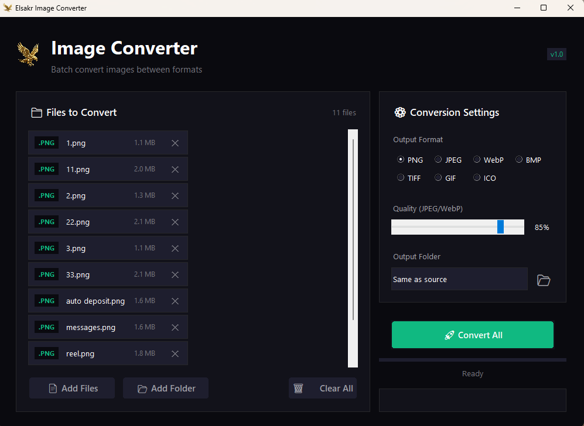

# 🦅 Elsakr Image Converter

[](https://elsakr.company)
[](https://elsakr.company)
[](LICENSE)


## Overview
Part of the **Elsakr Open Source Tools Ecosystem** — global proactive solutions for developers, designers, and marketers.
> **[View All Tools](https://elsakr.company/tools)**

**Converting 1000 images shouldn't take hours. Handle it in seconds.**
A robust bulk image conversion tool. Stop using slow online converters with file limits. This tool handles unlimited files, supports modern formats (WebP, HEIC), and runs locally for maximum speed.

## 🚀 Features
- 🔹 **Batch Conversion**: Convert thousands of images in one click.
- 🔹 **Modern Formats**: Support for WebP, PNG, JPG, BMP, TIFF.
- 🔹 **Quality Control**: Adjustable output quality settings.
- 🔹 **Offline**: 100% local processing.

## 📸 Screenshots / Demo


## 📦 Getting Started

### 💻 Installation
Download the latest release or clone the repo:
```bash
git clone https://github.com/khalidsakrjoker/Elsakr-Image-Converter.git
```

### ▶️ Usage
1. **Launch**: Open the application.
2. **Select**: Drag images or folders into the tool.
3. **Settings**: Choose your target format (e.g., WebP).
4. **Convert**: Watch it fly through the queue.

## 🤝 Contributing
We welcome contributions! See the `CONTRIBUTING.md` file (if available) or just open a PR.

## 📝 License
This project is licensed under the MIT License.

## ⭐ Signature
**Elsakr** — *Open Source Tools with a Falcon’s Vision.*  
[elsakr.company](https://elsakr.company)

---

# 🇪🇬 النسخة العربية (Arabic Version)

## 🦅 محول الصور (Image Converter)
حول آلاف الصور في ثواني. أداة بتدعم التحويل الجماعي بين كل الصيغ (WebP, JPG, PNG) وبدقة عالية، ومن غير ما ترفع صورك على النت.
